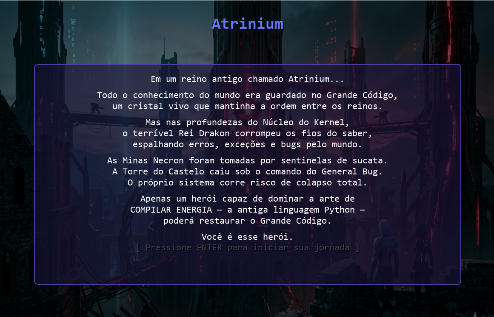
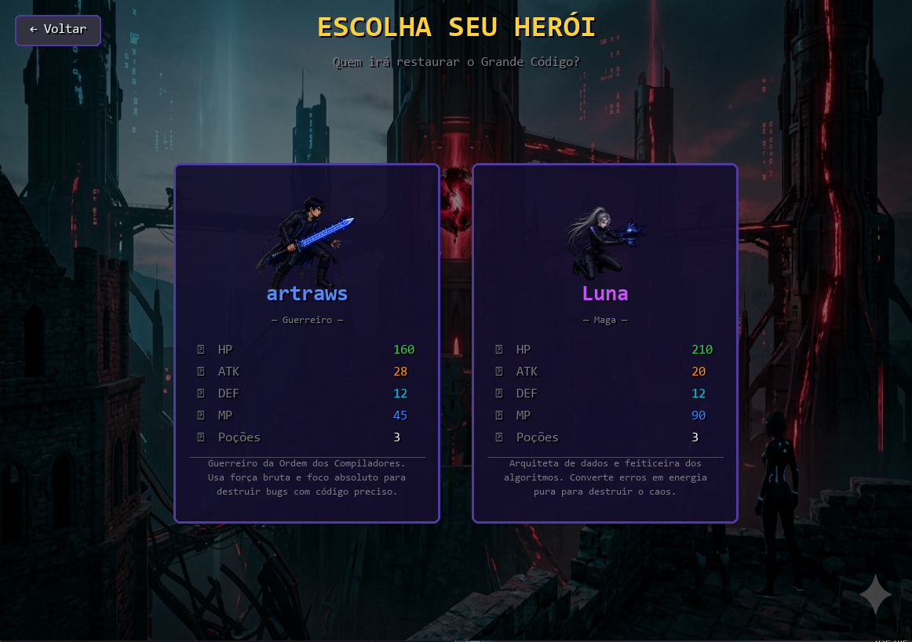
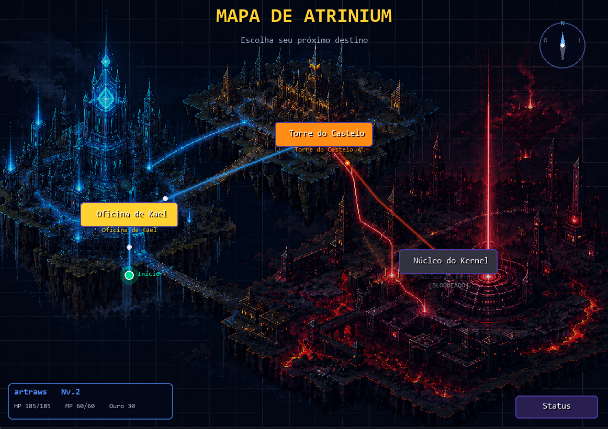
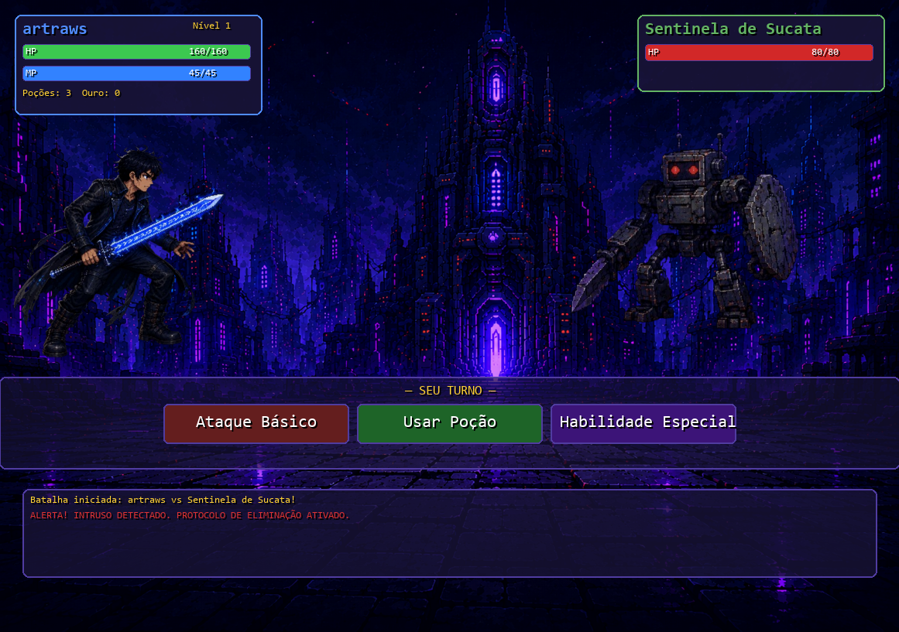
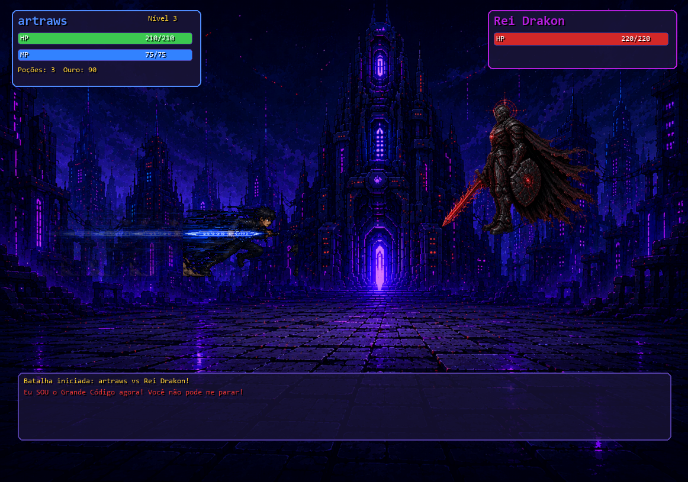
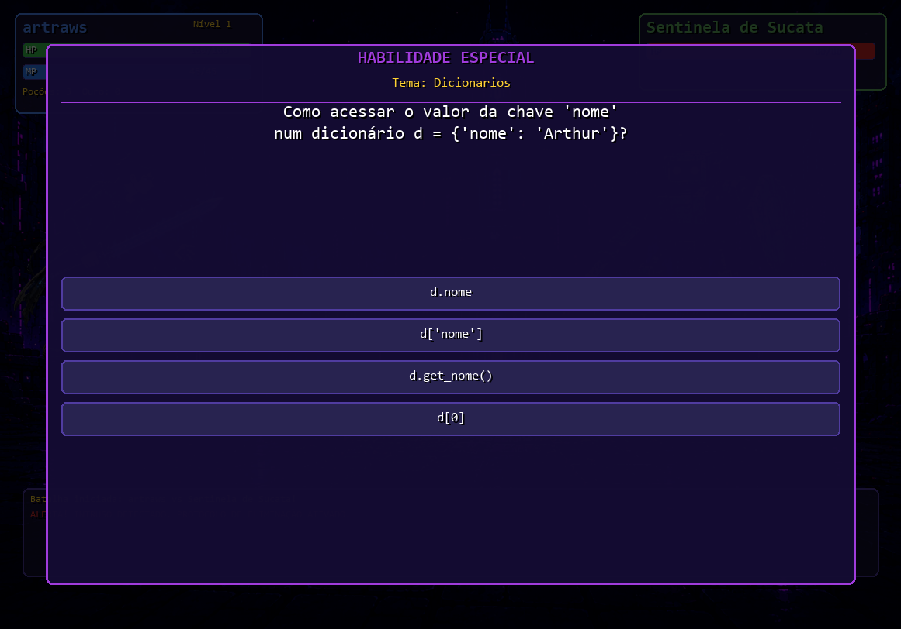
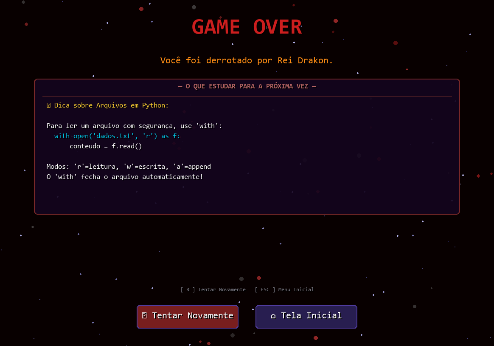

#  Atrinium

> Jogo de RPG educacional desenvolvido em Python com Pygame, onde o jogador aprende conceitos de programação enquanto combate inimigos em batalhas por turnos.

---

##  Descrição

**Atrinium** é um jogo RPG de batalha por turnos ambientado no reino de **Atrinium**. O Grande Código foi corrompido pelo temível **Rei Drakon**, e apenas um herói capaz de dominar a linguagem **Python** poderá restaurar a ordem.

O jogador escolhe entre dois heróis, explora o mapa, enfrenta chefes e responde perguntas sobre Python para desferir golpes especiais. Quanto mais correto o jogador for, mais poderoso se torna.

---

## 🖼️ Screenshots

### Tela Inicial


### Seleção de Herói


### Mapa de Atrinium


### Batalha



### Painel Python — Quiz


### Game Over


---

##  Conteúdo Educacional

| Chefe | Tema Python |
|---|---|
| Sentinela de Sucata | Dicionários |
| General Bug | Listas de Listas |
| Rei Drakon | Arquivos e Estruturas |

---

##  Requisitos

| Ferramenta | Versão recomendada |
|---|---|
| Python | **3.12.x** — [python.org/downloads](https://www.python.org/downloads/) |
| pygame-ce | **2.5.7** |
| opencv-python | **4.10.0.84** |


---

## 📦 Instalação

Abra o **PowerShell** (ou terminal) dentro da pasta do projeto e rode:

```bash
pip install pygame-ce==2.5.7 opencv-python==4.10.0.84
```

Para verificar se instalou corretamente:

```bash
python -c "import pygame; import cv2; print('OK')"
```

---

## ▶️ Como Executar

Entre na pasta `game/` e rode o `main.py`:

```bash
cd game
python main.py
```

---


**Controles durante o vídeo:**

| Tecla / Ação | Efeito |
|---|---|
| `ENTER` / `ESPAÇO` / `ESC` | Pular o vídeo |
| Clique do mouse | Pular o vídeo |

---

## 🎮 Controles do Jogo

| Tecla / Ação | Efeito |
|---|---|
| Mouse (clique) | Navegar menus, escolher ações em batalha |
| `ENTER` / `ESPAÇO` | Avançar diálogos e telas |
| `ESC` | Fechar painéis (ex: status no mapa) |
| `R` | Tentar novamente (tela de Game Over) |

---

## 🗺️ Locais do Mapa

| Local | Função |
|---|---|
| Oficina de Kael | Comprar poções e equipamentos com ouro |
| Torre do Castelo | Batalha contra o General Bug |
| Núcleo do Kernel | Batalha final contra o Rei Drakon |
---

## 📁 Estrutura do Projeto

```
game/
├── main.py
├── classes/
│   ├── Personagem.py
│   ├── Heroi.py
│   └── Vilao.py
├── states/
│   ├── intro_state.py
│   ├── hero_select_state.py
│   ├── video_state.py
│   ├── prologue_state.py
│   ├── battle_state.py
│   ├── attack_animation.py
│   ├── map_state.py
│   ├── shop_state.py
│   ├── levelup_state.py
│   ├── game_over_state.py
│   └── victory_state.py
├── data/
│   └── perguntas.py
├── utils/
│   ├── constants.py
│   ├── ui.py
│   ├── game_state_manager.py
├── assets/
│   ├── video.mp4
│   ├── audio.mp3
│   ├── mapa.png
│   ├── fundo1.png
│   ├── atack_arthur.png
│   └── atack_luna.png
│   ├── generalbug.png
│   ├── inicio.png
│   ├── sentinela.png
│   ├── artraws.png
│   ├── luna.png
│   └── drakon.png
└── screenshots/
    ├── intro.png
    ├── hero_select.png
    ├── mapa.png
    ├── battle.png
    ├── quiz.png
    └── atacar.png
```

---

## 🛠️ Tecnologias Utilizadas

- **Python 3.12** — linguagem principal
- **Pygame-CE 2.5.7** — engine de jogos 2D, renderização e eventos
- **OpenCV 4.10** — leitura e exibição de vídeo MP4
- **Programação Orientada a Objetos** — herança, encapsulamento, polimorfismo

---

## 👥 Desenvolvedores

| Nome | Função |
|---|---|
| Arthur | Desenvolvedor    |
| Amanda | Desenvolvedora   |


---

## 📚 Disciplina

> Projeto desenvolvido para a disciplina de **Princípios de Programação**  
> Curso: **Sistemas de Informação**  
> Instituição: **UFRPE**  
> Professor: **Cleyton Vanut**  
> Semestre: **2026.1**
